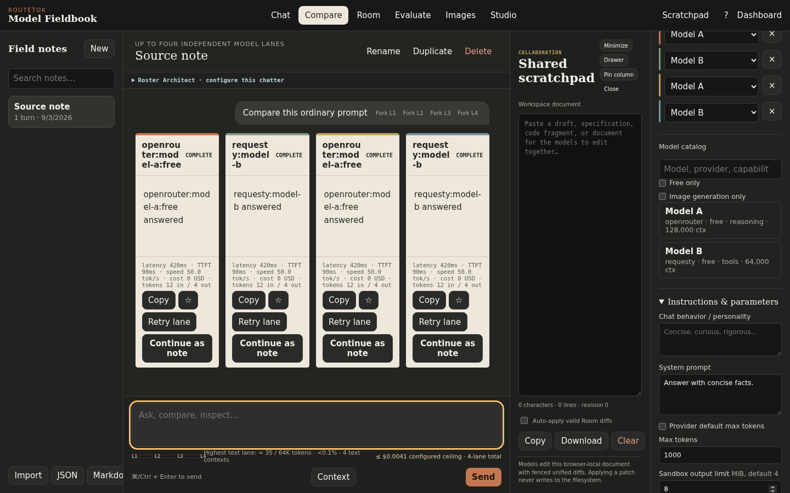
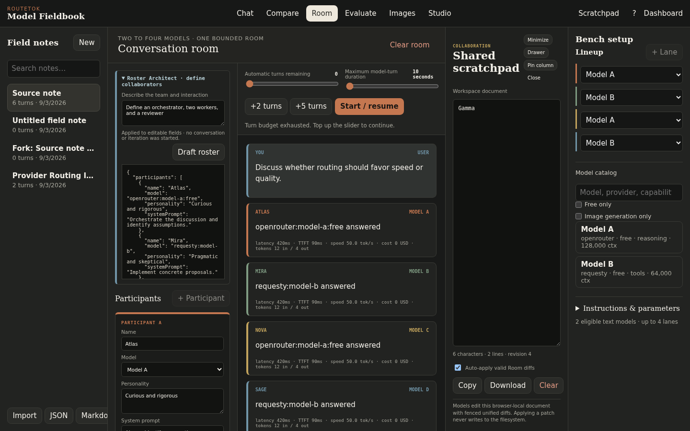
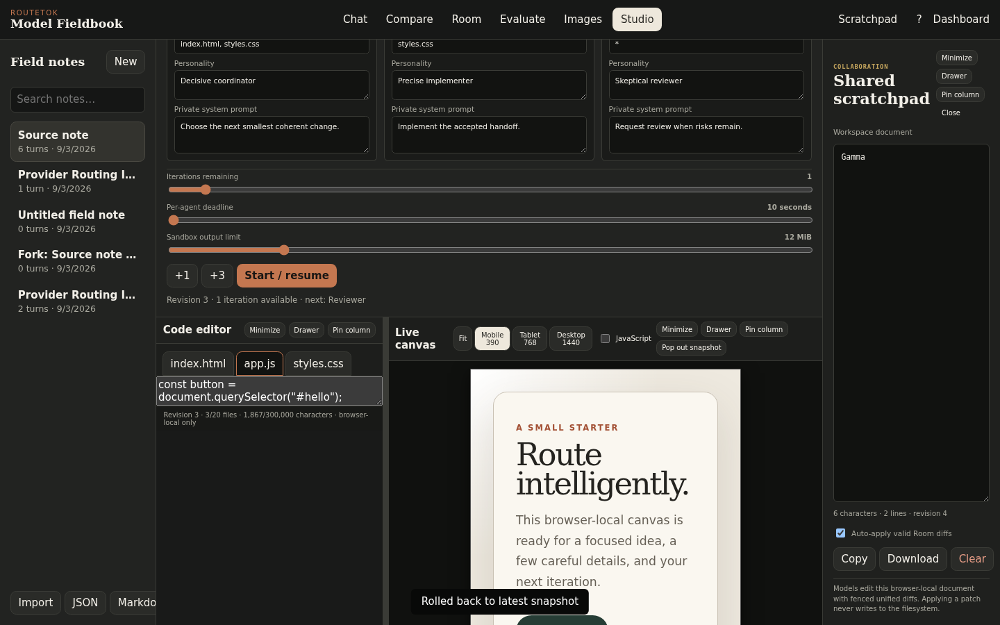

# RouteTok

**One local gateway for model routing, operations, and hands-on model work.**

RouteTok is a local-first inference router with OpenAI- and Anthropic-compatible APIs. It combines a resilient multi-provider proxy, an operations dashboard, and a standalone model Fieldbook in one dependency-light Node.js service.


> Screenshots contain synthetic data. RouteTok is independent and is not affiliated with or endorsed by any model or inference provider.

## Three Surfaces, One Router

| Surface | URL | What it does |
|---|---|---|
| **Proxy** | `/v1` | Gives existing OpenAI and Anthropic clients one stable endpoint with explicit routing, health-aware failover, canonical model IDs, and usage metadata. |
| **Dashboard** | `/dashboard` | Operates providers, credentials, model catalogs, route orders, custom cascades, health circuits, costs, live requests, and retained telemetry. |
| **Sandbox** | `/sandbox` | Provides the standalone Model Fieldbook for Chat, Compare, Room, Evaluate, Images, and browser-local multi-agent Studio workflows. |

The three surfaces share the same normalized model catalog and routing policy. The proxy handles application traffic, the dashboard explains and configures it, and the sandbox lets you test models and workflows before putting them into an application.

## Model Fieldbook

Compare up to four independent model lanes, preserve branches as field notes, estimate context and cost, and attach explicit one-shot context from the current note.



Run bounded two-to-four-model rooms with independent identities and private instructions, a shared revisioned scratchpad, pause/resume controls, deadlines, and visible turn budgets.



Use Iteration Studio to coordinate one to four scoped agents over a browser-local virtual web project. Agent patches, handoffs, reviews, and image requests are revision-checked and remain subject to explicit browser-enforced controls.



[Read the Fieldbook guide](docs/fieldbook.md) for persistence, context, evaluation, image, Studio, approval, and sandboxing details.

## Highlights

- OpenAI Chat Completions, OpenAI Responses, and Anthropic Messages compatibility
- Health-aware pre-output fallback without splicing streams across models
- Virtual routes: `auto`, `best`, `free`, plus ordered custom cascades
- Provider-isolated credentials and canonical routes such as `openrouter:model-id`
- Explicit enablement for paid or unknown-price external models
- Live request telemetry, historical metrics, TTFT, throughput, tokens, cache activity, and cost
- Human-reviewed, revision-bound routing configuration proposals
- Parallel text and image comparisons with authoritative per-result metrics
- Local Speaches transcription and catalog-confirmed OpenRouter speech support
- Browser-local Fieldbook notes, evaluations, rooms, scratchpads, and virtual Studio projects
- Opaque, network-blocked HTML/SVG/canvas previews and ephemeral generated media

## Quick Start

Requirements: Node.js 22 or newer.

```bash
git clone https://github.com/mojomast/routetok.git
cd routetok
npm ci
cp .env.example .env
```

Configure at least one provider in `.env`. OpenCode Zen can expose its curated free routes without an API key. Set both service tokens before allowing access beyond your machine.

```dotenv
PROXY_API_KEY=replace-with-a-client-key
DASHBOARD_TOKEN=replace-with-an-admin-token
```

```bash
npm run build
npm start
```

Open:

- `http://127.0.0.1:8787/dashboard` for operations
- `http://127.0.0.1:8787/sandbox` for the Model Fieldbook
- `http://127.0.0.1:8787/healthz` for service health

## Use It As A Proxy

RouteTok works with clients that support a custom OpenAI base URL:

```bash
curl http://127.0.0.1:8787/v1/chat/completions \
  -H 'Content-Type: application/json' \
  -H "Authorization: Bearer $ROUTETOK_PROXY_KEY" \
  -d '{
    "model": "best",
    "messages": [{"role":"user","content":"Explain this request path."}],
    "stream": true
  }'
```

Anthropic-compatible clients can use `POST /v1/messages` with `x-api-key`. Physical external routes are namespaced; virtual and custom routes resolve to ordered compatible candidates. RouteTok retries only before semantic output begins and reports the selected route through `x-router-*` response headers.

Ready-to-adapt client examples are in [`examples/`](examples/).

## Dashboard

The dashboard is the control plane for provider readiness, write-only credentials, enabled models, route order, custom cascades, circuit state, live requests, usage history, costs, and comparison workflows. Its assistant retrieves only bounded, allowlisted operational resources and cannot access secrets, files, shell commands, or raw retained request bodies.

[Read the Dashboard guide](docs/dashboard.md) for configuration and operational workflow details.

## Data And Safety

- RouteTok binds to `127.0.0.1` by default.
- Provider credentials stay server-side and stored overrides use owner-only filesystem permissions.
- Metrics persist routing metadata and usage, not prompt or response bodies.
- Authenticated request inspection is bounded and memory-only.
- Fieldbook content remains in the current browser's IndexedDB until deleted or site data is cleared.
- Audio and generated image bytes are ephemeral and excluded from metrics, history, notes, and exports.
- Studio works only with virtual project files and never reads or writes repository files.

Read the [security model](docs/security-model.md) before exposing RouteTok over a network.

## Documentation

- [Dashboard guide](docs/dashboard.md)
- [Model Fieldbook guide](docs/fieldbook.md)
- [Architecture](docs/architecture.md)
- [Configuration](docs/configuration.md)
- [Providers](docs/providers.md)
- [API reference](docs/api.md)
- [Deployment](docs/deployment.md)
- [Security model](docs/security-model.md)
- [Troubleshooting](docs/troubleshooting.md)
- [Contributing](CONTRIBUTING.md)

## Development

```bash
npm ci
npm run typecheck
npm test
npm run build
```

Integration tests use local mock providers and do not call external inference services.

## Compatibility

RouteTok retains legacy AgentRouter provider IDs, aliases, environment variables, response headers, Prometheus aliases, and persisted browser/server state where existing clients depend on them. New external providers use canonical namespaced model IDs.

## License

[MIT](LICENSE)
