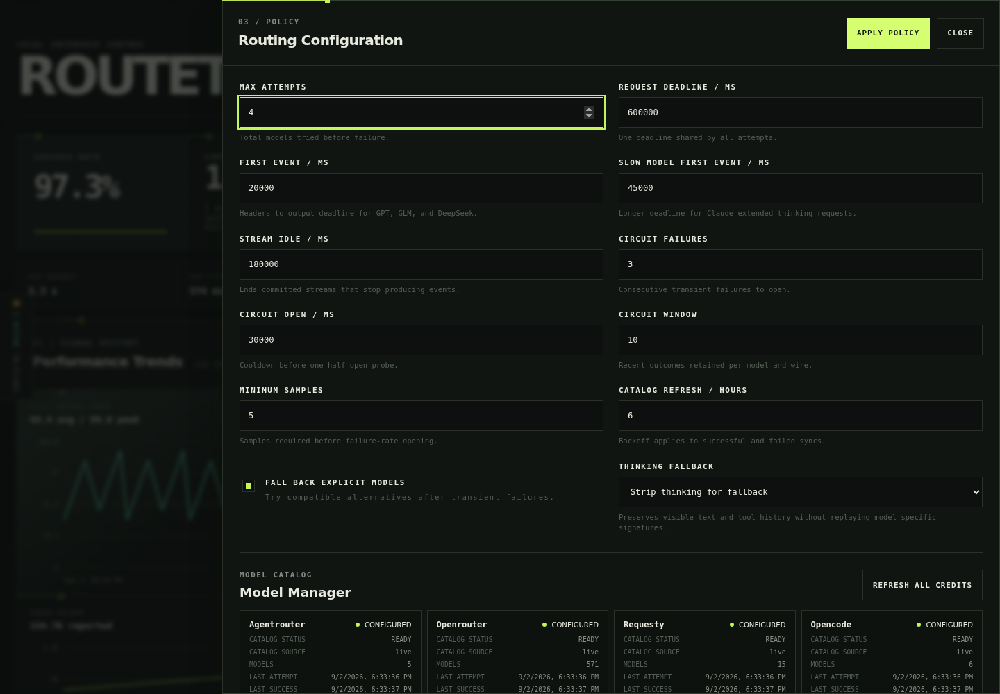
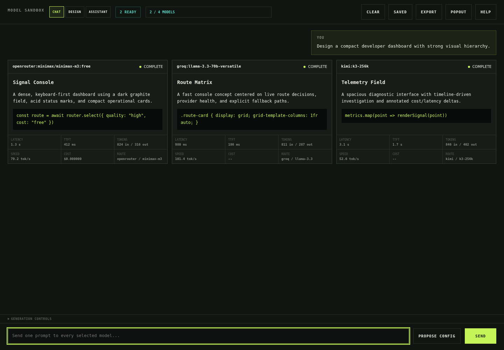

# RouteTok

RouteTok is a local-first token router that exposes OpenAI- and Anthropic-compatible APIs over multiple inference providers. It provides health-aware failover, named cascades, catalog and cost controls, Prometheus metrics, a full operations dashboard, and a parallel model/design sandbox.


> Screenshots use synthetic data. RouteTok is independent and is not affiliated with or endorsed by any model or inference provider.

## Highlights

- OpenAI Chat Completions, OpenAI Responses, and Anthropic Messages compatibility
- Explicit, health-aware fallback before output begins; streams are never spliced
- Provider-isolated credentials and canonical routes such as `groq:model-id`
- Virtual routes: `auto`, `best`, `free`, and user-defined named cascades
- Paid/unknown external models require explicit enablement
- Persistent metrics, live request telemetry, costs, cache usage, TTFT, and throughput
- Parallel multi-model arena with retries, multi-turn branches, saved runs, and exact metrics
- Static, sandboxed HTML design playground and saved design catalog
- Per-design JavaScript sandboxing and fullscreen card popouts
- Per-generation stars with a persistent starred gallery
- Human-reviewed configuration proposals with typed editable controls
- Write-only provider credential ingress with owner-only filesystem permissions

## Supported Providers

| Provider | Route prefix | Chat | Responses | Anthropic wire | Catalog pricing |
|---|---|---:|---:|---:|---|
| AgentRouter | legacy bare IDs | Yes | Yes | Yes | Ratios and billing events |
| OpenRouter | `openrouter:` | Yes | Provider-dependent | Yes | Live |
| Requesty | `requesty:` | Yes | Provider-dependent | Yes | Live |
| OpenCode Zen | `opencode:` | Yes | Selected models | No | Curated free list |
| Kimi Coding | `kimi:` | Yes | Yes | Yes | Unknown |
| Groq | `groq:` | Yes | Yes | No | Unknown |
| Together AI | `together:` | Yes | No | No | Live when reported |
| Fireworks AI | `fireworks:` | Yes | Yes | No | Unknown |
| DeepInfra | `deepinfra:` | Yes | No | No | Live when reported |
| Cerebras | `cerebras:` | Yes | No | No | Unknown |
| Mistral | `mistral:` | Yes | No | No | Unknown |
| Generic OpenAI | `generic:` | Yes | Opt-in | No | Unknown |

New providers do not enter automatic routing by default. Their unknown-price models must be explicitly enabled and added to an order or custom cascade.

See [provider details](docs/providers.md) for endpoint and compatibility notes.

## Quick Start

Requirements: Node.js 22 or newer.

```bash
git clone https://github.com/mojomast/routetok.git
cd routetok
npm ci
cp .env.example .env
```

Configure at least one provider in `.env`. OpenCode Zen can expose its curated free routes without a key.

```bash
npm run build
npm start
```

Default endpoints:

- Dashboard: `http://127.0.0.1:8787/dashboard`
- Fullscreen sandbox: `http://127.0.0.1:8787/sandbox`
- OpenAI API root: `http://127.0.0.1:8787/v1`
- Anthropic Messages: `http://127.0.0.1:8787/v1/messages`
- Prometheus: `http://127.0.0.1:8787/metrics`
- Health: `http://127.0.0.1:8787/healthz`

Protect inference with `PROXY_API_KEY` and dashboard/admin APIs with `DASHBOARD_TOKEN` before exposing RouteTok beyond loopback.

## Client Example

```bash
curl http://127.0.0.1:8787/v1/chat/completions \
  -H 'Content-Type: application/json' \
  -H "Authorization: Bearer $ROUTETOK_PROXY_KEY" \
  -d '{
    "model": "best",
    "messages": [{"role":"user","content":"Hello"}],
    "stream": true
  }'
```

Ready-to-adapt client files are in [`examples/`](examples/).

## Routing Model

- `best` and `auto` use explicit protocol-specific quality orders.
- `free` and `free-auto` use only verified zero-cost external text-generation routes.
- Named cascades are advertised as models and try only their ordered physical members.
- Explicit physical models can use global fallback when `fallbackExplicitModels` is enabled.
- Fallback is limited to transient/network/pre-output failures.
- `400`, authentication, entitlement, exhausted quota, and `429` responses do not fan out.
- Once semantic stream output is committed, RouteTok never changes models.
- Sandbox comparisons disable fallback so cards cannot be mislabeled.

AgentRouter retains legacy bare model IDs for compatibility. Other providers always use namespaced canonical IDs.

## Dashboard



The dashboard includes provider and key status, catalog filtering, price ranges, free-only views, route orders, custom cascades, live requests, circuits, request history, historical charts, themes, and layout controls.



The unified arena keeps independent Chat, Design, and Agent workstreams with their own drafts, lineups, settings, results, and scroll positions. It runs up to four independent model lanes in parallel, supports repeated lanes of the same model for output-variance testing, preserves branch-specific multi-turn context, retries failed cards, can omit `max_tokens` to use provider defaults, and automatically saves completed runs in browser IndexedDB.

Speech controls are built into the arena. Result cards can be read aloud through catalog-confirmed free OpenRouter TTS models, beginning with Deepgram Flux TTS Free and Fish Audio S2.1 Pro Free. Microphone recordings and uploaded audio can be transcribed through local Speaches or an approved Requesty transcription model. Discovered local models appear first, so the arena prefers local STT when available. Recordings, generated audio, filenames, and unreviewed transcripts remain ephemeral and are excluded from RouteTok metrics, history, retained request bodies, exports, and IndexedDB. Transcripts must be reviewed before insertion and are never sent automatically.

For example, run Speaches separately with a CPU INT8 faster-whisper model, then point RouteTok at its OpenAI-compatible API (RouteTok does not launch or manage the Speaches process or container):

```dotenv
LOCAL_STT_BASE_URL=http://127.0.0.1:8000/v1
LOCAL_STT_MODEL=Systran/faster-whisper-small
LOCAL_STT_API_KEY=
```

Configure Speaches itself to use CPU execution and INT8 compute according to the Speaches image/version you run. `LOCAL_STT_API_KEY` is optional; when empty, RouteTok sends no authorization header.

This repository includes a loopback-only, digest-pinned CPU deployment at `deploy/local-stt/compose.yml`. A one-shot initialization service downloads `Systran/faster-whisper-small` through Speaches' model-management API, while the inference service keeps it resident, uses INT8 with four CPU threads, disables the Speaches UI and Hugging Face telemetry, and persists only the model cache.

## Configuration Safety

The assistant can propose routing changes but cannot apply them. Proposals are validated, displayed as typed interactive settings, editable, revalidated after changes, revision-bound, and require a separate exact-diff confirmation.

Agent mode defaults to automatic intent detection for diagnosis, route explanation, onboarding, optimization, configuration, and comparison planning; explicit intent controls are available only inside Agent and override detection. Configuration language enters the editable proposal workflow instead of ordinary diagnostic chat. The bounded comparison planner can choose one to four eligible physical model lanes, including duplicate lanes when repeated samples are useful. Plans are validated and shown for review, then handed to Chat or Design as a draft; they never execute automatically. Result evidence is collapsed by default and includes model, endpoint, provider, route, request, attempt, timing, token/cache, throughput, cost, and generation-setting details.

Operational diagnosis uses lazy data retrieval. Each Agent model first requests only the bounded dashboard resources needed for the question, including capabilities, readiness, totals, health, recent failures, history, sanitized providers, or configuration. RouteTok supplies only those API results instead of embedding the entire catalog and metrics history in every prompt. The Agent can explain setup and client usage, diagnose and teach routing behavior, prepare comparisons and designs, and propose operational or configuration changes, but it cannot access secrets, files, shell, raw request bodies, or execute actions itself.

Provider keys entered in the dashboard are write-only. Stored overrides live under `DATA_DIR/secrets/provider-credentials.json` in a `0700` directory and `0600` file. Values are never returned in status, metrics, logs, proposals, or browser storage.

## Data And Privacy

- Provider credentials are plaintext at rest under owner-only permissions, matching the local `.env` threat model.
- Server metrics files contain routing metadata and usage, not prompt/response bodies.
- Up to 100 eligible client request bodies can be retained temporarily in process memory for authenticated inspection.
- Sandbox prompts, outputs, reasoning, metrics, and designs persist in the current browser's IndexedDB until deleted or site data is cleared.
- Dashboard tokens are stored in local storage for the configured dashboard origin.
- Generic base URLs and environment-overridden provider URLs are trusted operator configuration.

Read the full [security model](docs/security-model.md) before network exposure.

## Documentation

- [Architecture](docs/architecture.md)
- [Configuration reference](docs/configuration.md)
- [Provider notes](docs/providers.md)
- [API reference](docs/api.md)
- [Deployment](docs/deployment.md)
- [Security model](docs/security-model.md)
- [Troubleshooting](docs/troubleshooting.md)
- [Contributing](CONTRIBUTING.md)
- [Security policy](SECURITY.md)

## Development

```bash
npm ci
npm run typecheck
npm test
npm run build
```

Integration tests use local mock providers and do not call external inference services.

## Compatibility

The RouteTok rebrand preserves:

- `AGENTROUTER_*` provider variables and provider ID `agentrouter`
- Legacy bare AgentRouter model routes
- `agentrouter-auto` and `agentrouter-best` hidden aliases
- Existing `x-router-*` response headers
- Existing API paths and persisted server state
- Legacy `x-agentrouter-internal` acceptance alongside the new internal header
- Legacy `agentrouter_router_*` Prometheus aliases alongside `routetok_*`
- Migration from legacy dashboard browser-storage keys

## License

[MIT](LICENSE)
