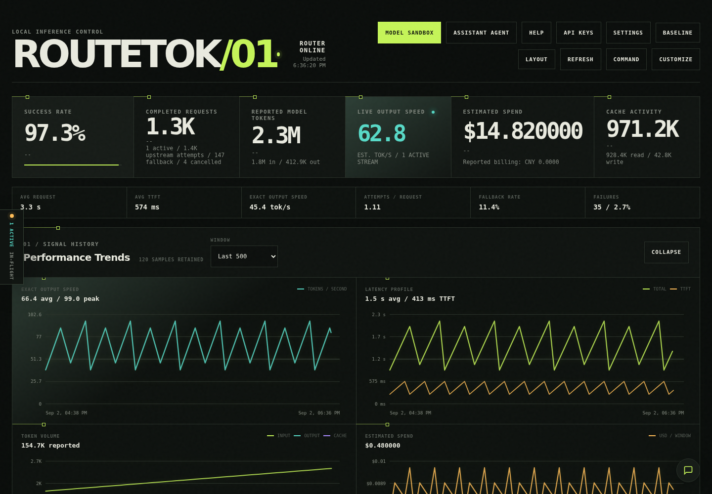
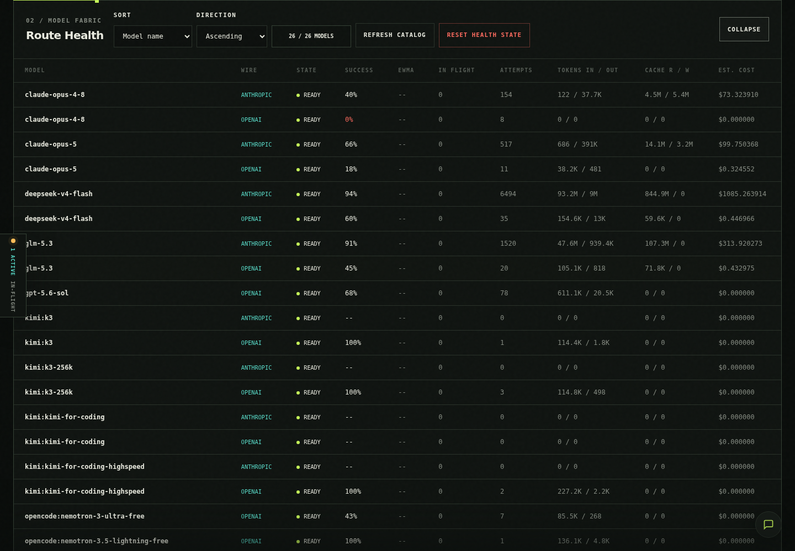
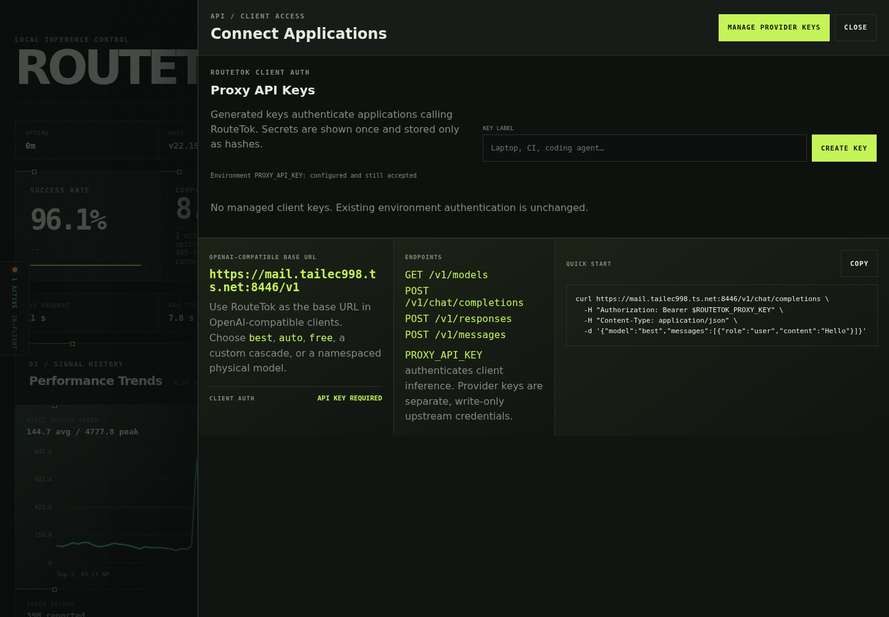

# Dashboard

The RouteTok dashboard at `/dashboard` is the operations and configuration surface for the proxy. It uses the same server-side catalog, routing policy, health state, and usage records as the inference endpoints.

> The screenshot shows a local development instance and contains no credential values.

## Operations

The dashboard exposes:

- Provider availability, catalog freshness, key status, and credit information
- Protocol-specific quality orders and the verified free-model order
- Explicit enablement for paid or unknown-price external models
- Named custom cascades with ordered physical members
- Active requests, route attempts, circuit state, failures, and bounded request inspection
- Historical request counts, latency, TTFT, throughput, token/cache usage, and provider-reported cost
- Theme, layout, chart, and workspace controls stored in the browser
- Top-level runtime, provider, authentication, and catalog status without a separate System card
- Browser-local Route Health sorting and per-model visibility controls
- A separate paid OpenRouter fallback editor that appends AgentRouter only as the last-resort tier

Configuration provider cards omit providers that are explicitly unconfigured, keeping the Model Manager focused on active integrations. Model catalog filtering and API-key setup still expose every supported provider so a hidden status card never blocks onboarding.

The client-facing `/v1/models` response is narrower than the operational catalog: it includes configured, enabled text routes only. The dashboard retains unavailable and unenabled catalog entries where needed for onboarding and spending approval.

Provider credentials entered through the dashboard are write-only. RouteTok stores them under `DATA_DIR/secrets/provider-credentials.json` with an owner-only directory and file permissions and never returns key material to the browser.

The Model Manager's Paid OpenRouter Fallback order accepts only paid or unknown-price `openrouter:` routes. Add and order alternatives there, then enable each model separately to approve spending. AgentRouter models are not placed in this editor; eligible AgentRouter entries from the normal protocol order are appended automatically after all healthy OpenRouter alternatives. This applies to exact paid OpenRouter requests even when `fallbackExplicitModels` is off and remains bounded by `maxAttempts`.

For Qwen, the intended conceptual order is requested Qwen, Nex N2 Mini, OpenRouter DeepSeek V4 Flash, Solar Pro 4, then AgentRouter. The dashboard does not hard-code display names to IDs: choose the exact currently deployed catalog IDs and account for enablement, health, protocol compatibility, and attempt limits.

## Support Agent

RouteTok Support is the dashboard's only conversational workspace. It can explain setup and routing, diagnose observed failures, help with onboarding, and prepare routing configuration proposals. General model chat and comparison workflows live in the standalone Fieldbook.

Support retrieves only the bounded operational resources required for the current question. It cannot access provider secrets, environment files, the filesystem, shell commands, or raw retained request bodies. Configuration proposals are typed, editable, revision-bound, revalidated after edits, and require a separate exact-diff confirmation before application.

## API Setup

The masthead API Setup button opens a dismissible, focus-contained Connect Applications drawer. It provides:

- The origin-derived OpenAI-compatible `/v1` base URL
- Chat Completions, Responses, Anthropic Messages, and model-list endpoint references
- A copyable curl example that reads `ROUTETOK_PROXY_KEY` from the caller's environment
- Current client-authentication status without exposing `PROXY_API_KEY`
- Direct access to write-only upstream provider credential management
- Generated, labelled, individually revocable RouteTok client keys

Client authentication and provider credentials are separate. The environment `PROXY_API_KEY` remains accepted for existing clients. Managed client keys are generated with high entropy, displayed once, and stored only as SHA-256 hashes under `DATA_DIR/secrets/client-api-keys.json`; revocation takes effect immediately. Provider credentials authorize RouteTok to call upstream services and can be replaced or disabled through the dashboard without ever being returned to the browser.

## Attempt Inspector

The dashboard loads `window.AttemptInspector` from `/attempt-inspector.js`. Paste an `x-router-attempt-summary` value to decode it locally, or pick a retained request via `GET /admin/api/live` and `GET /admin/api/history?limit=100`. Generated curl replay commands redact secret headers before display or copy.

## API Setup Test Request

The dashboard loads `window.ApiSetup` from `/api-setup.js`. The Connect Applications drawer pastes a client key once, sends a `GET /v1/models` test request with `Authorization: Bearer <key>`, and reports the advertised model count. An HTTP 401 shows key-remediation guidance without ever displaying secret values.

## Model Visibility Reasons

Route Health explains hidden routes with per-model visibility reasons from `GET /admin/api/models/visibility`: `unconfigured-provider`, `disabled`, `paid-needs-enable`, `unknown-price-needs-enable`, `image-only`, and `not-text-capable`. A model is visible only when its reasons list is empty.

## Dashboard And Fieldbook

The dashboard is optimized for operating RouteTok. The standalone [Model Fieldbook](fieldbook.md) at `/sandbox` is optimized for persistent model experimentation, evaluation, bounded model rooms, images, and virtual-project iteration. The two applications have separate browser storage and frontend assets while sharing authenticated server capabilities.
